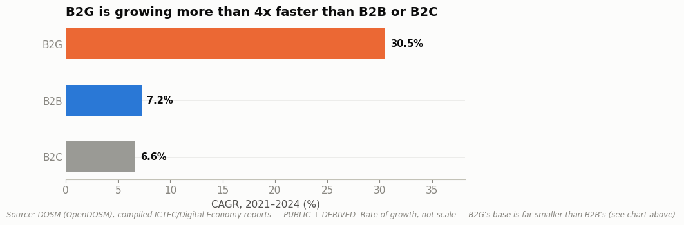

# Malaysia E-Commerce Market Intelligence Report (2020–2024)



**Part of a [6-case-study portfolio](https://github.com/ooi-darren)** — see the other five.

## The Question

How has Malaysia's e-commerce competitive landscape evolved between 2020 and 2024, and what should a business weigh when deciding where to invest?

## Status

✅ **Analysis complete.** Three notebooks, each answering a distinct sub-question, are done and committed. Key findings are summarized below.

## Key Findings

**1. Which customer segment is driving growth?** B2B remains the largest contributor by far (RM879.6 billion in 2024), but B2G is growing fastest (30.5% CAGR, 2021–2024) from a much smaller base. The right investment priority depends on time horizon: B2B for near-term scale, B2G for firms with a longer runway or existing government relationships. *([Notebook 01](./notebooks/01-ecommerce-segment-growth-analysis.ipynb))*
**Why:** This is largely policy-driven, not consumer-driven — Malaysia's ePerolehan e-procurement platform is routing more government spending online by mandate, not because government "shoppers" changed behavior. *(Full explanation in Notebook 01's "Why Is This Happening?" section.)*

**2. Is B2C growth driven by rising household income?** Household income and B2C e-commerce income happened to share an identical 6.6% CAGR — but their trajectories moved in opposite directions. Income growth was front-loaded (2020–2022) and decelerating; B2C growth was back-loaded and accelerating through 2023–2024. This suggests B2C is increasingly decoupling from income growth — a sign of genuine digital channel shift, not just a wealthier consumer base spending more. *([Notebook 02](./notebooks/02-income-vs-ecommerce-growth.ipynb))*
**Why:** Malaysia's digital payment infrastructure scaled dramatically over this window — e-wallet usage jumped from 63% to 88% of Malaysians in a single year — lowering the friction of buying online regardless of income growth. *(Full explanation in Notebook 02's "Why Is This Happening?" section.)*

**3. Which platform is actually winning?** No single metric gives a clean answer. Shopee's search interest has declined steadily since 2021, yet it remains the dominant platform by GMV and scale — likely reflecting habitual, direct-app usage replacing search-driven discovery. TikTok Shop's search interest stayed flat near zero throughout, even as its Malaysia GMV grew 150% in H1 2025 alone — a platform whose real growth search data alone would never reveal. A multi-platform strategy is the more defensible position for most businesses than betting on one. *([Notebook 03](./notebooks/03-platform-competitive-landscape.ipynb))*
**Why:** TikTok Shop is a discovery-driven platform (livestream selling, ~40% of its GMV) rather than a search-driven one like Shopee — most of its buyers never typed anything into a search bar in the first place. *(Full explanation in Notebook 03's "Why Is This Happening?" section.)*

## Explain It Simply

Imagine three different kinds of shoppers buying things online in Malaysia: businesses buying from other businesses (B2B), regular people buying for themselves (B2C), and the government buying supplies and services (B2G). This project asks which of these is actually driving Malaysia's online shopping boom — and whether the popular assumption (that it's mostly "people shopping online") is even true.

The answer has three parts:

- **Which one is biggest?** Business-to-business, by a wide margin — most of the money isn't people buying shoes online, it's companies buying from other companies.
- **Which one is growing fastest?** Business-to-government — mainly because the Malaysian government has been pushing more of its own purchasing online, not because more consumers are shopping.
- **Which app is actually winning?** It depends how you measure it. The app people search for most (Shopee) and the app growing fastest right now (TikTok Shop) aren't the same app — because people increasingly discover what to buy on TikTok Shop without ever searching for it.

The short version: "online shopping in Malaysia" is really three separate stories happening at once, each pushed forward by a different force — not the same trend counted three times. (New to terms like "B2B" or "GMV"? See the [Glossary](#glossary) near the bottom.)

## Why This Project

Most public "e-commerce analysis" projects run customer segmentation or sales prediction on generic transactional datasets — a technical exercise with no country or market context. This project takes a different approach: a market-level competitive intelligence report, grounded in official public data with every figure traced to its source, rather than a Kaggle download.

## Data Sources

Every dataset is labeled **PUBLIC** (official government source), **DERIVED** (compiled by the author from public sources), or **ESTIMATED** (third-party market research, not government-verified). Full definitions and known limitations for all six datasets are documented in [`DATA_DICTIONARY.md`](./DATA_DICTIONARY.md).

| Dataset | Source | Classification | Frequency |
|---|---|---|---|
| Wholesale & Retail Trade | DOSM (OpenDOSM) | PUBLIC | Monthly |
| External Trade | DOSM (OpenDOSM) | PUBLIC | Monthly |
| Household Income | DOSM (OpenDOSM) | PUBLIC | Biennial survey |
| Household Income by State | DOSM (OpenDOSM) | PUBLIC | Biennial survey |
| E-Commerce Income (2020–2024) | Compiled from 5 DOSM ICTEC/Digital Economy reports | DERIVED | Annual |
| Platform Search Interest | Google Trends | PUBLIC (proxy metric) | Monthly |
| Platform GMV & Traffic | Third-party market research (Momentum Works, Mordor Intelligence, others) | ESTIMATED | Snapshot, 2024–2025 |

## Notebooks

| # | Question | Data Rigor |
|---|---|---|
| [01 — Segment Growth](./notebooks/01-ecommerce-segment-growth-analysis.ipynb) | Which customer segment (B2B/B2C/B2G) is driving growth? | PUBLIC + DERIVED |
| [02 — Income vs. E-Commerce](./notebooks/02-income-vs-ecommerce-growth.ipynb) | Is B2C growth tracking household purchasing power? | PUBLIC + DERIVED |
| [03 — Platform Landscape](./notebooks/03-platform-competitive-landscape.ipynb) | Which platform is actually winning, and what should a business do about it? | PUBLIC proxy + ESTIMATED |

## Methodology

Business problem → objectives → data acquisition → cleaning → analysis → visualization → insight → recommendation. Every notebook opens with the question and the answer, then shows the reasoning between them — including what the data didn't support.

## Reproducing This Analysis

```bash
pip install -r requirements.txt
jupyter notebook notebooks/
```

All data used is already included in `data/processed/` — notebooks read directly from there, so no external downloads are required to re-run the analysis.

## Repository Structure

```
data/
├── raw/          # Original files, unmodified, as downloaded from source
└── processed/    # Cleaned/compiled datasets ready for analysis
notebooks/        # Analysis notebooks
references/       # Source PDFs and supporting documents
DATA_DICTIONARY.md
```

## Glossary

Plain-language definitions for the technical terms used in this project.

- **B2B / B2C / B2G:** Who's buying from whom. **B2B** = one business buying from another. **B2C** = a regular person buying from a business. **B2G** = the government buying from a business.
- **GMV (Gross Merchandise Value):** The total value of everything sold through a platform, before the platform takes its cut — a common way to measure how big an e-commerce app actually is.
- **CAGR (Compound Annual Growth Rate):** The average yearly growth rate of something over several years, as if it had grown at one smooth, steady pace instead of jumping around. Useful for comparing growth across things that grew unevenly.
- **PUBLIC / DERIVED / ESTIMATED:** How traceable a number in this project is. **PUBLIC** = taken directly from an official source. **DERIVED** = built by combining several official sources by hand. **ESTIMATED** = based on a secondary/market-research source that couldn't be independently verified. See [`DATA_DICTIONARY.md`](./DATA_DICTIONARY.md) for exactly how every number here was classified.

## Author

Darren Ooi — [LinkedIn](https://www.linkedin.com/in/darrenooizhixian)